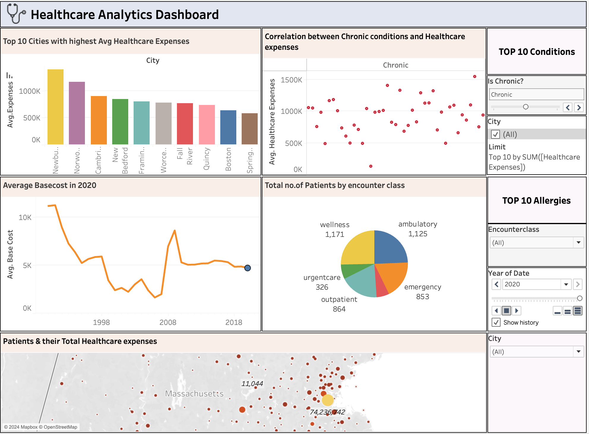

# Healthcare-Data-Analytics

## Project Overview 

This repository encapsulates a sophisticated analytics workflow designed to extract strategic insights from healthcare data. The initiative employs a streamlined process utilizing premier data management and visualization technologies to address pivotal business questions in the healthcare domain.

## **Data Source**

The initial dataset was collected and pre-processed using Microsoft Excel. The cleaned data was then imported into Snowflake, a cloud data warehousing solution, where it was queried to extract meaningful patterns and relationships.

The data used in this project can be found at [<https://synthea.mitre.org/downloads>].

## **Technological Stack**

-   **Microsoft Excel**: Employed for data cleansing and preliminary organization.

-   **Snowflake**: Utilized for robust data storage and complex SQL query execution.

-   **Tableau**: Deployed to synthesize data into interactive and comprehensive visual analytics.

## **Business Intelligence Queries**

The project articulates and resolves several business-critical inquiries, including but not limited to:

-   What are the average healthcare expenses across different cities?

-   How does the number of visits correlate with patient healthcare expenses?

-   What are the most common conditions affecting patients in Boston?

-   Which procedures are most frequently carried out?

-   What are the allergy prevalence rates for dairy, soya, and fish?

Detailed SQL queries implemented for the Snowflake platform are accessible via (<https://app.snowflake.com/kxujqgo/ay46296/w4dHvYev2Utn/query>), providing transparency and reproducibility of the analytical process.

## **Data Analysis and Visualization**

The SQL queries written for Snowflake are designed to sift through vast amounts of patient data to identify key trends and metrics, such as patient distribution by city, encounter types, and healthcare expenses. These queries are integral in fueling the Tableau dashboard, which presents the data in an easily digestible format for business stakeholders.

### **Dashboard** 

###  
